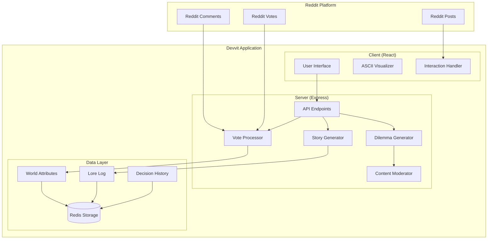

# CrowdLore Design Document

## Overview

CrowdLore is a community storytelling game built on Reddit's Devvit platform that transforms daily decision-making into a collaborative narrative experience. The system presents daily moral or creative dilemmas to Reddit communities, processes collective votes and comments, and evolves a persistent fictional world through summarized outcomes and ASCII visualizations.

The application follows Devvit's client-server architecture with a React frontend for user interaction and an Express backend for Reddit integration, data persistence, and content generation.

## Architecture

### High-Level Architecture



### Component Interaction Flow

1. **Daily Cycle**: Automated dilemma generation creates new World_Decision_Posts
2. **User Interaction**: Reddit users vote and comment on decision options
3. **Processing**: Vote tallying determines winning choices and triggers story updates
4. **Visualization**: ASCII art generation represents story outcomes
5. **Persistence**: World state and lore updates stored in Redis

## Components and Interfaces

### Client Components

#### DilemmaDisplay Component

- **Purpose**: Renders daily decision scenarios with voting options
- **Props**: `dilemma: DilemmaData`, `onVote: (optionId: string) => void`
- **Features**:
  - Three-option voting interface
  - World attribute impact indicators
  - Real-time vote count updates
  - Mobile-responsive design

#### ASCIIVisualizer Component

- **Purpose**: Displays ASCII art representations of story outcomes
- **Props**: `scene: ASCIIScene`, `caption: string`
- **Features**:
  - Animated ASCII rendering
  - Responsive text scaling
  - Caption overlay

#### WorldStatus Component

- **Purpose**: Shows current world attributes and lore summary
- **Props**: `attributes: WorldAttributes`, `recentLore: string[]`
- **Features**:
  - Attribute progress bars
  - Scrollable lore history
  - Trend indicators

#### SplashScreen Component

- **Purpose**: Engaging entry point for Reddit users
- **Features**:
  - Animated world preview
  - "Join the Story" call-to-action
  - Current decision teaser

#### UserProfile Component

- **Purpose**: Displays individual user statistics and achievements
- **Props**: `userId: string`, `userStats: UserStats`
- **Features**:
  - Voting history timeline
  - Achievement badges display
  - Personal impact on world attributes
  - Voting streak counter

#### Leaderboard Component

- **Purpose**: Shows community rankings and competitive metrics
- **Props**: `leaderboardData: LeaderboardEntry[]`, `currentUser: string`
- **Features**:
  - Multiple ranking categories (votes, streaks, accuracy)
  - User position highlighting
  - Seasonal and all-time views
  - Achievement showcase

### Server Components

#### DilemmaGenerator Service

```typescript
interface DilemmaGenerator {
  generateDailyDilemma(): Promise<DilemmaData>;
  validateContent(content: string): ContentValidation;
  balanceOptions(options: DilemmaOption[]): DilemmaOption[];
}

type DilemmaData = {
  id: string;
  title: string;
  scenario: string;
  options: DilemmaOption[];
  createdAt: Date;
  expiresAt: Date;
};

type DilemmaOption = {
  id: string;
  text: string;
  attributeEffects: WorldAttributeEffects;
  description: string;
};
```

#### VoteProcessor Service

```typescript
interface VoteProcessor {
  processVotes(dilemmaId: string): Promise<VoteResult>;
  determineWinner(votes: VoteData[]): DilemmaOption;
  generateSummary(winner: DilemmaOption, votes: VoteData[]): string;
}

type VoteResult = {
  winningOption: DilemmaOption;
  totalVotes: number;
  summary: string;
  attributeChanges: WorldAttributeEffects;
};
```

#### StoryGenerator Service

```typescript
interface StoryGenerator {
  updateWorldState(changes: WorldAttributeEffects): Promise<WorldState>;
  generateLoreEntry(outcome: VoteResult): string;
  createASCIIScene(outcome: VoteResult): ASCIIScene;
}

type WorldState = {
  attributes: WorldAttributes;
  loreLog: string[];
  lastUpdated: Date;
};

type ASCIIScene = {
  lines: string[];
  caption: string;
  maxWidth: number;
};
```

#### ContentModerator Service

```typescript
interface ContentModerator {
  moderateContent(content: string): ModerationResult;
  replaceInappropriate(content: string): string;
  flagRiskyContent(content: string): ContentFlag[];
}

type ModerationResult = {
  isAppropriate: boolean;
  flags: ContentFlag[];
  sanitizedContent: string;
};
```

#### UserStatsService

```typescript
interface UserStatsService {
  getUserProfile(userId: string): Promise<UserProfile>;
  updateUserVote(userId: string, dilemmaId: string, optionId: string): Promise<void>;
  processVoteOutcome(userId: string, dilemmaId: string, wasWinner: boolean): Promise<void>;
  awardAchievement(userId: string, achievement: Achievement): Promise<void>;
}

type UserProfile = {
  userId: string;
  username: string;
  totalVotes: number;
  winningVotes: number;
  currentStreak: number;
  longestStreak: number;
  achievements: Achievement[];
  joinDate: Date;
  lastVoteDate: Date;
};

type Achievement = {
  id: string;
  name: string;
  description: string;
  iconUrl: string;
  unlockedAt: Date;
};
```

#### LeaderboardService

```typescript
interface LeaderboardService {
  getLeaderboard(category: LeaderboardCategory, timeframe: TimeFrame): Promise<LeaderboardEntry[]>;
  getUserRank(userId: string, category: LeaderboardCategory): Promise<number>;
  updateUserStats(userId: string, stats: Partial<UserStats>): Promise<void>;
}

type LeaderboardCategory = 'totalVotes' | 'winningPercentage' | 'currentStreak' | 'achievements';
type TimeFrame = 'allTime' | 'monthly' | 'weekly';

type LeaderboardEntry = {
  rank: number;
  userId: string;
  username: string;
  score: number;
  change: number; // position change from previous period
};
```

## Data Models

### Core Data Types

```typescript
type WorldAttributes = {
  stability: number; // -10 to +10
  curiosity: number; // -10 to +10
  survival: number; // -10 to +10
  reputation: number; // -10 to +10
};

type WorldAttributeEffects = {
  stability?: number; // -3 to +3
  curiosity?: number; // -3 to +3
  survival?: number; // -3 to +3
  reputation?: number; // -3 to +3
};

type DilemmaTheme = 'exploration' | 'diplomacy' | 'humor' | 'discovery' | 'survival' | 'mystery';

type ContentFlag = {
  type: 'political' | 'sexual' | 'hateful' | 'personal' | 'brand';
  severity: 'low' | 'medium' | 'high';
  location: string;
};

type UserStats = {
  totalVotes: number;
  winningVotes: number;
  winningPercentage: number;
  currentStreak: number;
  longestStreak: number;
  achievementCount: number;
  favoriteAttribute: keyof WorldAttributes;
  averageImpact: number;
};

type AchievementType =
  | 'firstVote'
  | 'tenVotes'
  | 'hundredVotes'
  | 'fiveWinStreak'
  | 'tenWinStreak'
  | 'monthlyParticipant'
  | 'worldShaper'
  | 'consistentVoter';
```

### Redis Data Schema

```typescript
// World state storage
const WORLD_STATE_KEY = 'crowdlore:world:state';
const LORE_LOG_KEY = 'crowdlore:world:lore';

// Daily dilemma storage
const CURRENT_DILEMMA_KEY = 'crowdlore:dilemma:current';
const DILEMMA_HISTORY_KEY = 'crowdlore:dilemma:history';

// Vote tracking
const VOTE_DATA_KEY = (dilemmaId: string) => `crowdlore:votes:${dilemmaId}`;
const USER_VOTES_KEY = (userId: string) => `crowdlore:user:${userId}:votes`;

// User profiles and statistics
const USER_PROFILE_KEY = (userId: string) => `crowdlore:user:${userId}:profile`;
const USER_ACHIEVEMENTS_KEY = (userId: string) => `crowdlore:user:${userId}:achievements`;

// Leaderboards
const LEADERBOARD_KEY = (category: string, timeframe: string) =>
  `crowdlore:leaderboard:${category}:${timeframe}`;
const USER_RANK_KEY = (userId: string, category: string) => `crowdlore:rank:${userId}:${category}`;
```

## Error Handling

### Client-Side Error Handling

```typescript
// API call wrapper with retry logic
const apiCall = async <T>(endpoint: string, options?: RequestInit): Promise<T> => {
  const maxRetries = 3;
  let lastError: Error;

  for (let i = 0; i < maxRetries; i++) {
    try {
      const response = await fetch(`/api${endpoint}`, options);
      if (!response.ok) {
        throw new Error(`HTTP ${response.status}: ${response.statusText}`);
      }
      return await response.json();
    } catch (error) {
      lastError = error as Error;
      if (i < maxRetries - 1) {
        await new Promise((resolve) => setTimeout(resolve, 1000 * (i + 1)));
      }
    }
  }

  throw new Error(`API call failed after ${maxRetries} attempts: ${lastError.message}`);
};

// Error boundary for React components
class CrowdLoreErrorBoundary extends React.Component {
  // Standard error boundary implementation
  // Fallback UI shows "Something went wrong" with retry option
}
```

### Server-Side Error Handling

```typescript
// Global error handler middleware
const errorHandler = (error: Error, req: Request, res: Response, next: NextFunction) => {
  console.error(`API Error [${req.method} ${req.path}]:`, error);

  if (error instanceof ValidationError) {
    return res.status(400).json({
      status: 'error',
      message: 'Invalid request data',
      details: error.details,
    });
  }

  if (error instanceof ContentModerationError) {
    return res.status(422).json({
      status: 'error',
      message: 'Content violates community guidelines',
      sanitized: error.sanitizedContent,
    });
  }

  // Generic server error
  res.status(500).json({
    status: 'error',
    message: 'Internal server error',
    requestId: req.headers['x-request-id'],
  });
};
```

### Redis Connection Resilience

```typescript
const redisClient = redis.createClient({
  retry_strategy: (options) => {
    if (options.error && options.error.code === 'ECONNREFUSED') {
      return new Error('Redis server connection refused');
    }
    if (options.total_retry_time > 1000 * 60 * 60) {
      return new Error('Retry time exhausted');
    }
    return Math.min(options.attempt * 100, 3000);
  },
});
```

## Testing Strategy

### Unit Testing Approach

#### Client Component Testing

- **Framework**: Vitest + React Testing Library
- **Coverage**: All interactive components, hooks, and utilities
- **Focus Areas**:
  - User interaction flows (voting, navigation)
  - ASCII rendering accuracy
  - Responsive behavior
  - Error state handling

```typescript
// Example test structure
describe('DilemmaDisplay', () => {
  it('renders three voting options correctly', () => {
    // Test option rendering and click handlers
  });

  it('shows attribute effects for each option', () => {
    // Test attribute impact indicators
  });

  it('handles vote submission errors gracefully', () => {
    // Test error state display
  });
});
```

#### Server Logic Testing

- **Framework**: Vitest
- **Coverage**: Business logic, data processing, content generation
- **Focus Areas**:
  - Dilemma generation algorithms
  - Vote processing accuracy
  - Content moderation effectiveness
  - ASCII art generation

```typescript
// Example test structure
describe('DilemmaGenerator', () => {
  it('generates balanced three-option scenarios', () => {
    // Test option balance and variety
  });

  it('applies content moderation correctly', () => {
    // Test inappropriate content filtering
  });

  it('maintains world attribute constraints', () => {
    // Test attribute effect limits
  });
});
```

### Integration Testing

#### API Endpoint Testing

- **Framework**: Supertest + Vitest
- **Coverage**: All `/api/*` endpoints
- **Test Data**: Mock Redis with realistic world states

```typescript
describe('API Integration', () => {
  beforeEach(async () => {
    await setupMockRedis();
    await seedTestData();
  });

  it('processes complete vote cycle', async () => {
    // Test dilemma creation → voting → outcome processing
  });
});
```

#### Reddit Integration Testing

- **Approach**: Mock Devvit context and Reddit API responses
- **Coverage**: Post creation, user authentication, vote collection

### Performance Testing

#### Load Testing Scenarios

1. **Concurrent Voting**: 1000+ simultaneous votes on active dilemma
2. **Content Generation**: Rapid dilemma generation under load
3. **Redis Operations**: High-frequency world state updates

#### Performance Targets

- **API Response Time**: < 200ms for 95th percentile
- **ASCII Generation**: < 50ms per scene
- **Vote Processing**: < 500ms for 1000 votes
- **Memory Usage**: < 100MB server footprint

### Automated Testing Pipeline

```typescript
// Test execution order
const testSuite = {
  unit: ['client', 'server', 'shared'],
  integration: ['api', 'reddit'],
  performance: ['load', 'memory'],
  e2e: ['user-flows'],
};

// CI/CD integration
// - Run on every PR
// - Performance regression detection
// - Automated deployment on test pass
```

## Security Considerations

### Content Security

- **Input Sanitization**: All user-generated content sanitized before storage
- **XSS Prevention**: React's built-in XSS protection + CSP headers
- **Content Moderation**: Multi-layer filtering for inappropriate content

### Data Privacy

- **User Data**: Minimal collection (Reddit username only)
- **Vote Privacy**: Individual votes not exposed publicly
- **Data Retention**: Automatic cleanup of old decision data

### Rate Limiting

- **API Endpoints**: 100 requests/minute per user
- **Vote Submission**: 1 vote per dilemma per user
- **Content Generation**: Throttled to prevent abuse

## Deployment Architecture

### Devvit Platform Integration

- **Client Build**: Vite bundle to `dist/client/`
- **Server Build**: Express app to `dist/server/index.cjs`
- **Asset Management**: Static assets in `assets/` directory
- **Configuration**: `devvit.json` defines post and server entry points

### Environment Configuration

```typescript
const config = {
  development: {
    subreddit: 'crowdlore_dev',
    logLevel: 'debug',
    mockData: true,
  },
  production: {
    subreddit: 'crowdlore',
    logLevel: 'info',
    mockData: false,
  },
};
```

### Monitoring and Observability

- **Error Tracking**: Console logging with structured error data
- **Performance Metrics**: API response times and Redis operation latency
- **User Analytics**: Vote participation rates and engagement metrics
- **Health Checks**: Automated endpoint monitoring

This design provides a robust foundation for building CrowdLore as an engaging, scalable community storytelling experience on Reddit's platform.
